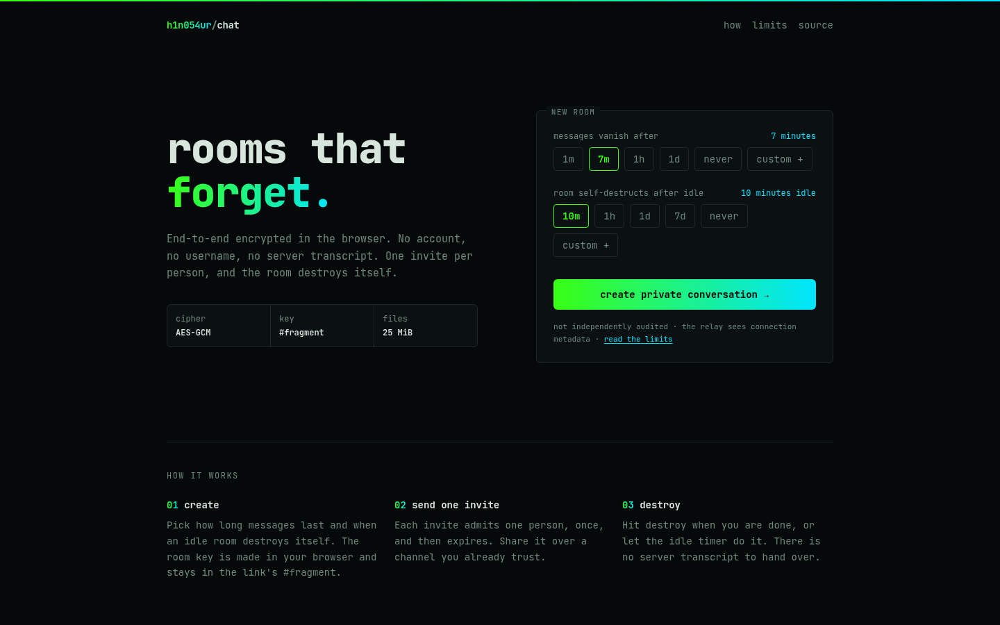
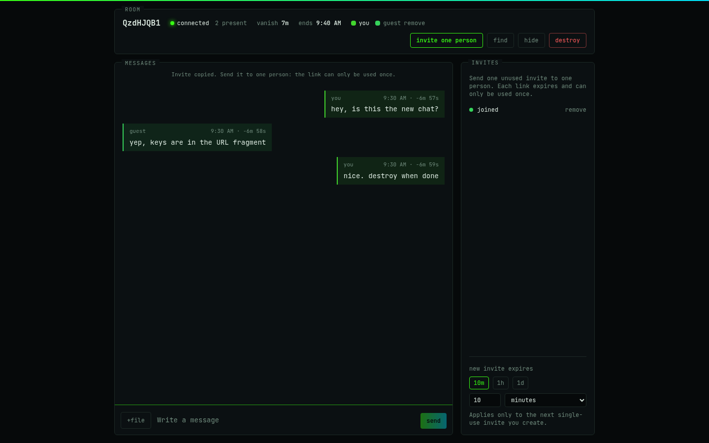
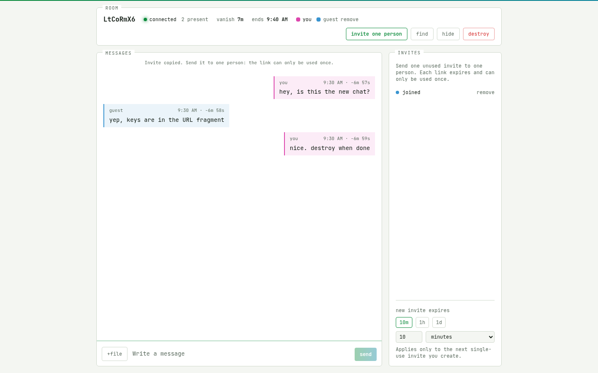
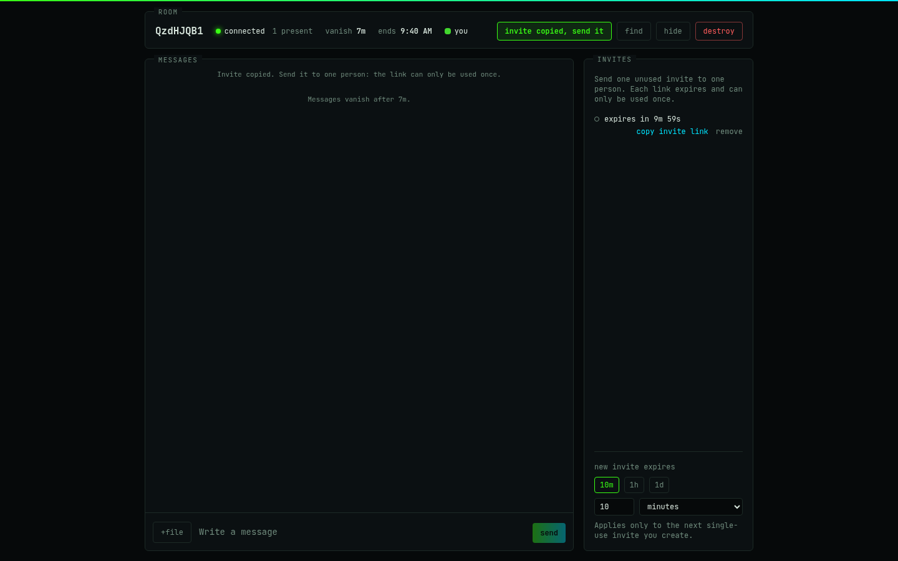
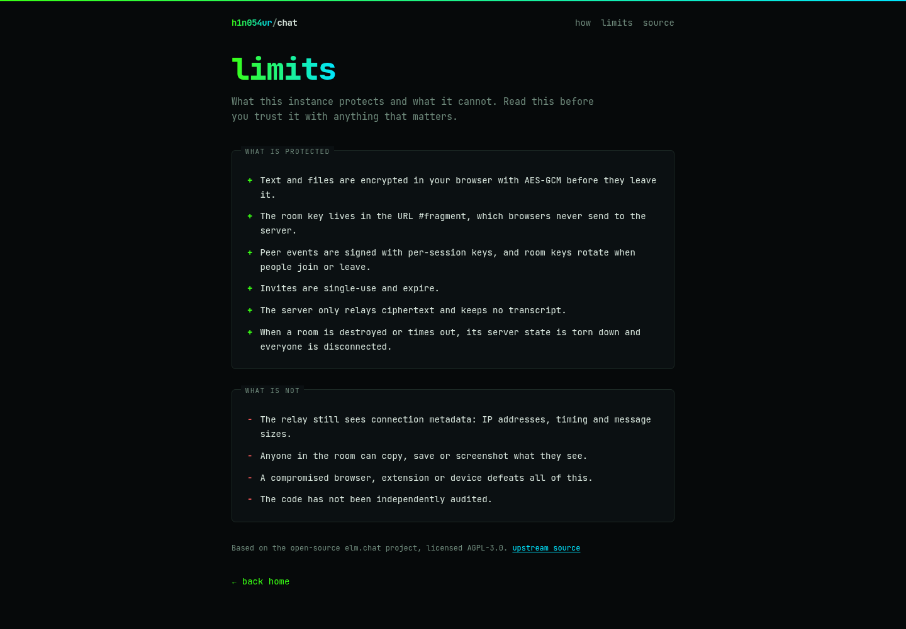
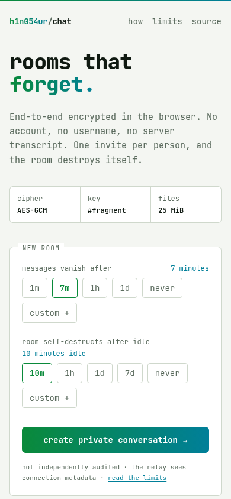
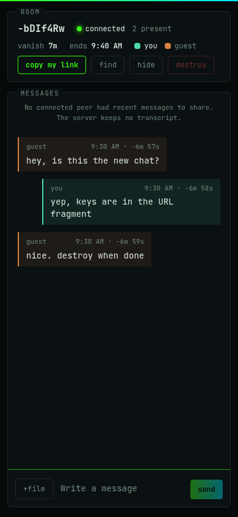
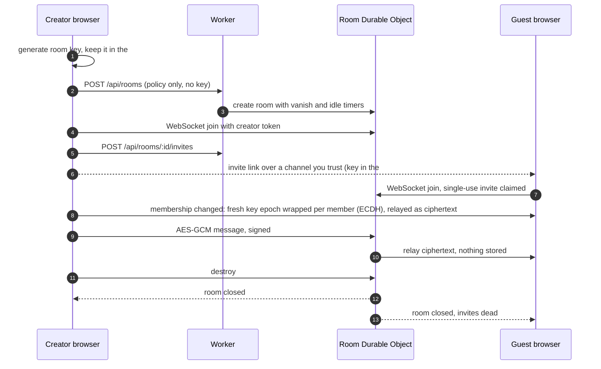
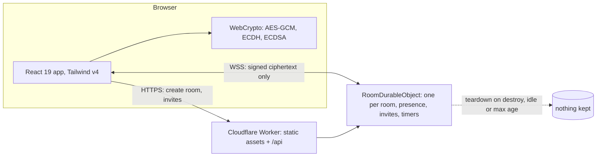

<h1 align="center">chat.h1n054ur.dev</h1>

<p align="center">
  <b>Private rooms that forget.</b><br>
  End-to-end encrypted, account-free chat rooms that destroy themselves. One Cloudflare Worker, one Durable Object per room, no database.
</p>

<p align="center">
  <a href="https://chat.h1n054ur.dev"><b>Open the live instance</b></a> ·
  <a href="https://chat.h1n054ur.dev/limits">Limits</a> ·
  <a href="docs/architecture.md">Architecture</a> ·
  <a href="docs/threat-model.md">Threat model</a>
</p>

<p align="center">
  <a href="LICENSE"></a>
  
  
  
  
</p>

<p align="center">
  
</p>

A self-hosted build of [elm.chat](https://github.com/shawnbure/elm-chat) by shawnbure, restyled in the h1n054ur terminal look and stripped down to the chat itself: no marketing pages, no analytics, no third-party requests.

> [!WARNING]
> Not independently audited. The relay sees connection metadata (IP addresses, timing, sizes), and anyone in a room can copy what they see. Read [the limits](https://chat.h1n054ur.dev/limits) before trusting it with something that matters.

## Screenshots

| Room, dark | Room, light |
|---|---|
|  |  |
| **Invites panel** | **Limits page** |
|  |  |

<p align="center">
  
  &nbsp;&nbsp;
  
</p>

## What it does

- **No accounts.** Each browser session gets a temporary colour identity instead of a username.
- **End-to-end encrypted text and files.** AES-GCM in the browser; every peer event is signed with the session's ephemeral ECDSA key; room keys rotate (ECDH-wrapped) when people join or leave. Files up to 25 MiB travel as encrypted, signed 64 KiB chunks with a whole-file SHA-256 check.
- **The key never reaches the server.** The room secret lives in the URL `#fragment`, which browsers do not send.
- **Single-use invites.** The creator issues one expiring invite per person, can revoke unused ones and remove anyone connected.
- **Rooms that end.** Messages vanish on a timer (1 minute to 1 day, or never), rooms self-destruct when idle (10 minutes to 7 days, or never) or on demand, and teardown disconnects everyone.
- **Nothing kept.** The Durable Object relays ciphertext over one WebSocket and stores no transcript.
- **Light and dark, phone and desktop, English and Spanish** (follows the browser).

## How a room works



## Architecture



Encrypted payloads are relayed through the room's Durable Object rather than sent peer-to-peer: no participant learns another's IP address, no STUN or TURN servers are involved, and it works on mobile and restrictive networks. The cost is that the relay can observe connection metadata. Details in [docs/architecture.md](docs/architecture.md), [docs/threat-model.md](docs/threat-model.md), [docs/message-protocol-v2.md](docs/message-protocol-v2.md) (describes protocol v3) and [docs/room-lifecycle.md](docs/room-lifecycle.md).

The page loads nothing from other origins. Every response carries a strict CSP (`default-src 'self'; connect-src 'self'; script-src 'self'; frame-ancestors 'none'`), `Referrer-Policy: no-referrer` and `X-Frame-Options: DENY`, and the font is self-hosted.

## Stack

| Layer | Choice |
|---|---|
| Web app | React 19, Vite 6, Tailwind CSS v4 (`@tailwindcss/vite`), JetBrains Mono via Fontsource |
| Crypto | WebCrypto: AES-GCM, ECDH, ECDSA, SHA-256 (`packages/crypto`) |
| Server | Cloudflare Worker (`workers/api`) serving the assets and API |
| Rooms | SQLite-backed Durable Object per room (`durable-objects/room`) |
| Tooling | bun workspaces, TypeScript, Vitest with `@cloudflare/vitest-plugin`, Playwright browser checks |
| Deploy | Forgejo Actions: CI on every push, `bun run deploy` on `main` |

```
apps/web/            React app (landing, room, limits) and theme.css
workers/api/         Worker: rooms API, invites, WebSocket upgrade, security headers
durable-objects/room RoomDurableObject: presence, invites, timers, relay
packages/crypto      browser crypto helpers
packages/shared      shared types and limits
scripts/             config and protocol checks, browser checks
docs/                architecture, threat model, protocol, verification notes
```

## Run it locally

Needs [bun](https://bun.sh) 1.4 and a Chromium-based browser for the browser checks.

```sh
bun install
bun run dev        # Vite on http://localhost:3000, Worker + Durable Object on :8799
```

Checks:

```sh
bun run typecheck
bun run build      # config + protocol checks, web build, Worker dry run
bun run test       # Vitest in the Workers runtime
```

The browser checks in `scripts/check-*-browser.mjs` and `scripts/check-*-races.mjs` drive two real browsers against a local `wrangler dev`. See [docs/LOCAL-RELAY-SMOKE.md](docs/LOCAL-RELAY-SMOKE.md); note the `--local-upstream` flag, which keeps links on the local origin while the config carries a custom-domain route.

## Deploy your own

1. Fork this repository and change the `routes` custom domain in **both** `wrangler.jsonc` and `workers/api/wrangler.jsonc` (or remove it to use `*.workers.dev`).
2. `bunx wrangler login`, then `CLOUDFLARE_ACCOUNT_ID=<your account> bun run deploy`. The Durable Object migration runs on first deploy; the Workers Free plan is enough.
3. Optional: gate room creation with Cloudflare Turnstile by building with `VITE_TURNSTILE_SITE_KEY` and setting the Worker secret `TURNSTILE_SECRET`. With neither set, creation is open.

Keep rooms short-lived on the free plan: file transfers are relayed through the Worker and count against your usage.

## Changes from upstream

This is a modified version of [shawnbure/elm-chat](https://github.com/shawnbure/elm-chat) (AGPL-3.0). Changes, as required by section 5 of the license:

| Date | Change |
|---|---|
| 2026-10-03 | New UI ("look B", terminal identity) on Tailwind v4: landing with duration presets, a `/limits` page, one-surface room with an invites panel, full-screen states, light and dark |
| 2026-10-03 | Removed elm.chat promotion and tracking: marketing and article pages, sitemap, RSS, IndexNow, `llms.txt`, GitHub star and issue feed, growth analytics (Worker, Durable Object, Analytics Engine), deploy-button route, canonical elm.chat redirect, upstream `security.txt` |
| 2026-10-03 | CSP `connect-src` tightened to `'self'`; `robots.txt` and a `noindex` meta keep the instance out of search |
| 2026-10-03 | bun instead of npm, Forgejo Actions instead of GitHub Actions, custom domain chat.h1n054ur.dev |

Upstream's history is kept intact; see [CHANGELOG.md](CHANGELOG.md) and [docs/UPSTREAM-SYNC.md](docs/UPSTREAM-SYNC.md) for how upstream changes are pulled in.

## Repository

Development happens on a private Forgejo instance; this GitHub repository is a read-only push mirror and the public source for the instance at chat.h1n054ur.dev. Issues and pull requests are not tracked here. Protocol or security problems that affect elm.chat itself belong [upstream](https://github.com/shawnbure/elm-chat).

## License

[GNU Affero General Public License v3.0](LICENSE), same as upstream. If you run a modified version as a network service, you must offer its users the corresponding source (section 13). This mirror is that offer for chat.h1n054ur.dev.
