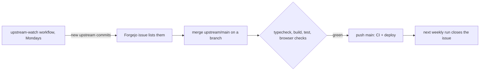

# Upstream sync

This repository is a modified [shawnbure/elm-chat](https://github.com/shawnbure/elm-chat). Upstream history is kept, so upstream changes come in with a normal merge.



## When

`.forgejo/workflows/upstream-watch.yml` runs every Monday (and on demand). It fetches upstream `main` and keeps one issue, "Upstream: new elm.chat commits to review", listing upstream commits that are not merged here. Once they are merged, the next run closes it.

## How

```sh
git fetch upstream
git switch -c upstream-sync main
git merge upstream/main
```

Expect conflicts where this repository deliberately differs:

| Area | Ours | What to do |
|---|---|---|
| `apps/web/src/App.tsx` landing, full-screen states, room markup | look B on Tailwind | keep our markup, port upstream behaviour changes into it; keep the hook classes the browser checks use |
| `apps/web/src/styles.css`, `MarketingPage.tsx`, `growth.ts`, `apps/web/scripts/*` | deleted | keep them deleted; re-express any real fix elsewhere |
| `apps/web/src/localization.ts` | pruned, new keys | take new upstream keys (English and Spanish), keep ours |
| `workers/api/src/index.ts` | promo routes and elm.chat redirect removed, `connect-src 'self'` | keep removals and the CSP |
| `wrangler.jsonc`, `workers/api/wrangler.jsonc` | custom-domain route, no Analytics Engine | keep ours; take new runtime bindings or migrations |
| `package.json` scripts, lockfile | bun, removed checks | keep bun; run `bun install` and commit `bun.lock` |
| README, CHANGELOG, docs | rewritten | keep ours; add a row to "Changes from upstream" only if we change something new |

Then run everything before pushing:

```sh
bun install
bun run typecheck && bun run build && bun run test
```

and the browser checks against a local `wrangler dev` (see [LOCAL-RELAY-SMOKE.md](LOCAL-RELAY-SMOKE.md); remember `--local-upstream`). `check-key-rotation-races` already failed on upstream before our changes; see the open Forgejo issue for it.

Merge the branch into `main`, push to Forgejo, and let CI and the deploy run. The GitHub mirror follows automatically.
